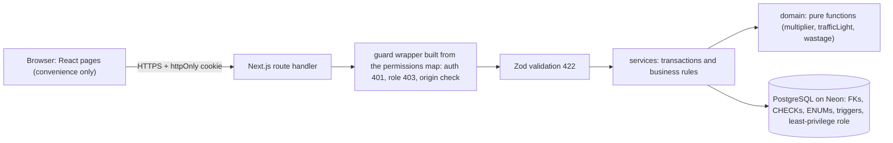
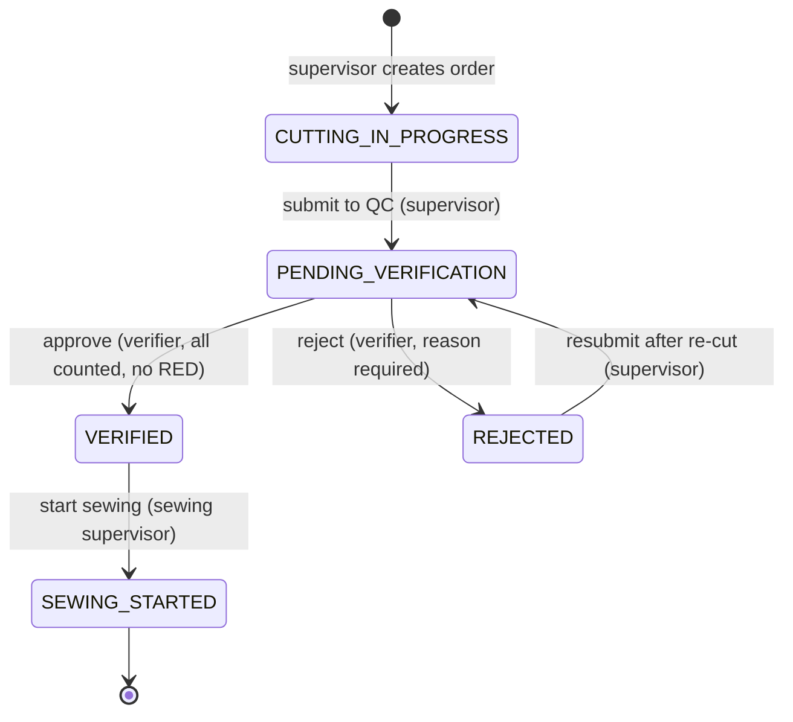
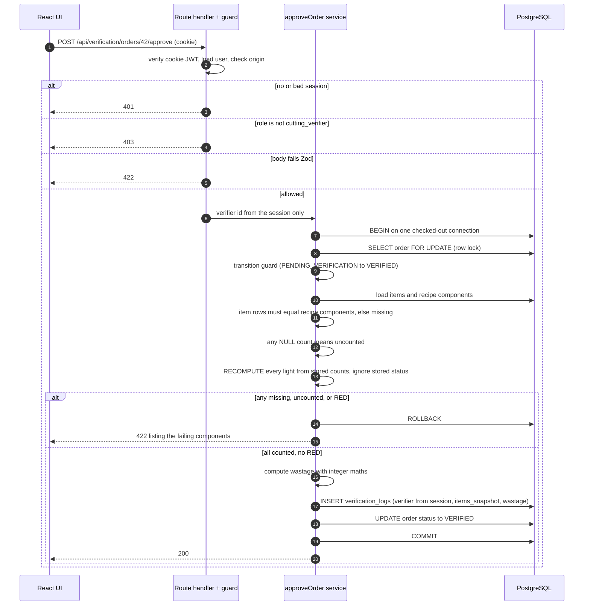
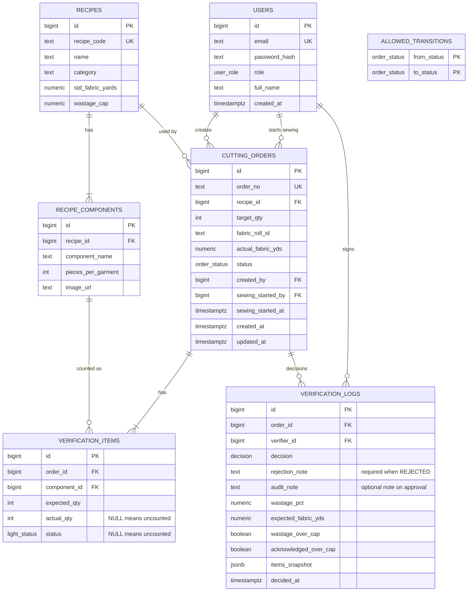

# ApparelFlow ERP: Architecture (v2.2)

> Cutting Operations & Gatekeeper Verification Terminal.
> **Core idea:** a cutting batch can never reach sewing unless a different person, the Verifier, has counted every component and the **server** agrees nothing is short (PDF §3, §7.4, §9).

**Status:** v2.2 (6 Oct 2026). The database layer, login and guard, order creation and submit, and the pure domain functions are built and tested (see section 15). Approve, reject, sewing and all screens are not built yet. Everything below marked **[planned]** is still a plan.
**PDF citations** use the assessment's section numbers: §3 problem and hard-stop boundary, §5 personas, §6 state machine and audit, §7.x functional spec, §8 schema, §9 security, §10 tests, §11 UI and non-functional, §12 AI report, §13 schedule, §14 submission, §15 rubric, §16 evaluator audit.
Items marked **[proposed]** are mine and need your yes or no. Everything else is yours or was confirmed earlier.

---

## 0. What changed since v1

| Change | Why | PDF |
|---|---|---|
| React + Express split replaced by **Next.js App Router + route handlers**, one Vercel deployment, gated by a 2-hour spike (D18) | Job title and §(header) tech stack name Next.js; removes sleeping-backend and CORS risk | header, §14 |
| `verification_logs` keeps `rejection_note` exactly as PDF §8 names it and gains an optional `audit_note` (approvals), `items_snapshot` (both decisions), `acknowledged_over_cap` (D13) | Sewing must review audit notes; audit must survive re-cuts | §5, §6, §8 |
| Item counts and status are NULL together, NULL = uncounted (D14) | Makes "uncounted" a first-class blocked state | §9 |
| Wastage uses exact integer maths, can be negative (D15) | Avoids float errors at the cap boundary | §7.5 |
| Log immutability in three layers plus honest limits (D16) | Audit values must be immutable | §6 |
| One permissions map drives guards, a coverage test, and the README table (D17) | No endpoint can silently skip RBAC | §5, §9, §10 |
| `npm test` runs on PGlite with zero secrets (D19) | Evaluator must run tests on a fresh clone | §10, §14 |
| Schedule compressed to 5 to 8 Oct (D20) | Owner decision | §13 |
| Supertest replaced by direct route-handler calls **[proposed, D22]** | Next route handlers are functions, not an HTTP server | §10 |
| Cookie hardening and CSRF defence **[proposed, D21]** | httpOnly cookies are CSRF-exposed without it | §9 |

---

## 1. Stack

| Layer | Choice | Why |
|---|---|---|
| Framework | Next.js (App Router, route handlers) | UI and API in one project; matches the job title |
| Database | PostgreSQL on Neon | Triggers, CHECKs, row locks, transactions (§8, §9) |
| DB access | Raw SQL with `pg` behind a tiny adapter | Every query is explainable; adapter lets tests use PGlite |
| Validation | Zod, same schemas on client and server | Rejects negatives, decimals, strings, empties (§11) |
| Auth | bcryptjs (pure JavaScript, no native build) + JWT in an httpOnly cookie | Not readable by page JavaScript; simple on one domain |
| Tests | Vitest; PGlite for `npm test`; Neon branch for race and privilege tests | Zero-secret fresh-clone run (§10, §14) |
| Hosting | Vercel (one deployment), Neon (DB) | Public URL (§14) |
| Language | JavaScript | Fewer new things in 4 days |

**Two connection strings (Neon):**

| Variable | Role | Used by |
|---|---|---|
| `DATABASE_URL` | `apparelflow_app` (least privilege), pooled endpoint | The running app |
| `DATABASE_URL_ADMIN` | `apparelflow_owner`, direct endpoint | `db:migrate` and `db:seed` only, never deployed to the app runtime |

Transactions and `SELECT ... FOR UPDATE` work through a pooler as long as the whole transaction runs on one checked-out connection. Session-level tricks (like `SET ROLE`) do not survive pooling, so the app connects *as* its own role. Verify both points in the Day 1 spike.

---

## 2. Layers: who is allowed to do what



**Rule:** the UI may hide things; only the layers to its right can *forbid* things (§9: "disabled buttons, hidden tabs, and frontend redirects are not security boundaries").

### Defense in depth

| # | Layer | Example | Response | PDF |
|---|---|---|---|---|
| 1 | UI | Approve disabled when a component is RED or uncounted | convenience only | §7.4, §11 |
| 2 | Authenticate | Missing, invalid, or expired cookie | 401 | §9 |
| 3 | Authorize | Supervisor calls approve | 403 | §9 |
| 4 | Origin check | Browser POST from another site | 403 | §9 |
| 5 | Zod validation | Negative qty, empty reject reason | 422 | §10 (Test 3), §11 |
| 6 | State-machine guard | VERIFIED to VERIFIED | 409 | §6, §9 |
| 7 | Business rule, recomputed inside the locked transaction | Any RED, missing, or uncounted component | 422 | §9 |
| 8 | Database | CHECKs, FKs, ENUMs, immutable-log triggers, role grants | error and rollback | §6, §8 |

**Never rely on Next.js middleware as the only gate.** Middleware is convenient but is a single point of failure, and middleware-bypass bugs have been published for Next.js. Every route handler is wrapped by the guard built from the permissions map (D17), so a bypassed middleware changes nothing.

---

## 3. Folder structure (as built, 6 Oct 2026)

```
apparelflow-erp/
  app/
    layout.js page.js globals.css                  template page; real screens [planned]
    api/
      health/route.js                              built
      auth/{login,logout,me}/route.js              built
      recipes/route.js                             built
      orders/route.js                              built (GET list, POST create)
      orders/[id]/submit/route.js                  built
      verification/orders/route.js                 step 13 (written, run it to confirm)
      verification/orders/[id]/route.js            step 13
      verification/orders/[id]/counts/route.js     step 13
      verification/orders/[id]/{approve,reject}/   [planned] the gate
      orders/[id]/resubmit  sewing/*               [planned]
  lib/
    permissions.js          THE single map (D17)
    guard.js                withGuard(routeKey, handler)
    http.js                 HttpError, json, parseBody (400 bad JSON, 422 bad fields)
    auth/session.js         sign, read cookie, load user from the database
    db.js                   lazy pg Pool in production, useTestAdapter() hook for PGlite
    validation/schemas.js   Zod schemas
    domain/                 multiplier.js trafficLight.js wastage.js
    services/               createOrder submitOrder (built); saveCounts verificationDetail (step 13)
                            approveOrder rejectOrder resubmitOrder startSewing [planned]
  db/
    migrations/             001_schema.sql 002_triggers.sql 003_roles.sql 004_hard_stop.sql
    migrate.mjs  seed.mjs  demo-data.mjs
  tests/                    flat folder, run by `npm test` on PGlite, zero secrets
    helpers/                db.js fixtures.js api.js
  scripts/                  schema-attacks, trigger-attacks, hard-stop-attacks, seed-check,
                            pglite-check, neon-grants-check (extra evidence, run with node)
  ARCHITECTURE.md  README.md [planned]  AI_LOG.md  AI_OPTIMIZATION_REPORT.md [planned]
```

The spike routes and the `spike_lock` table were deleted after the stack decision (the spike login used a hard-coded password and the real JWT secret, so it had to go before real auth shipped).

---

## 4. Permissions map and API table (D17)

### How it works

One file, `lib/permissions.js`, maps every endpoint to its allowed roles. Three things read it:

1. **The guard.** `withGuard('POST /api/verification/orders/[id]/approve', handler)` looks up the roles, so a route cannot forget its check.
2. **A coverage test.** It scans `app/api/**/route.js`, lists every exported method and path, and **fails if any endpoint is missing from the map** (and fails if the map lists an endpoint that does not exist).
3. **The README table.** `npm run docs:permissions` renders the map into the README, and a test fails if the committed table is out of date.

A role-by-endpoint matrix test is *generated from the same map*: for every endpoint it asserts anonymous gets 401, each disallowed role gets 403, and each allowed role gets neither.

Design sketch (not final code):

```js
export const PERMISSIONS = {
  'GET /api/health':                               'public',
  'POST /api/auth/login':                          'public',
  'GET /api/auth/me':                              'authenticated',
  'POST /api/verification/orders/[id]/approve':    ['cutting_verifier'],
  // ...every route, no exceptions
};
```

### Endpoint table

| Endpoint | Allowed roles | Purpose | Notable failures | PDF |
|---|---|---|---|---|
| `GET /api/health` | public | liveness | | §14 |
| `POST /api/auth/login` | public | email + password, sets cookie | 401 | §5 |
| `POST /api/auth/logout` | authenticated | clears cookie | 401 | §5 |
| `GET /api/auth/me` | authenticated | current user and role | 401 | §5 |
| `GET /api/recipes` | cutting_supervisor, cutting_verifier | read-only recipes and components | 403 | §7.1 |
| `GET /api/orders` | cutting_supervisor | cutting orders, all statuses, progress | 403 | §5, §7.2 |
| `POST /api/orders` | cutting_supervisor | create (CUTTING_IN_PROGRESS) | 422 | §7.2 |
| `GET /api/orders/[id]` | cutting_supervisor | detail | 404 | §5 |
| `PATCH /api/orders/[id]` | cutting_supervisor | edit roll ID and yards only, while IN_PROGRESS or REJECTED | 409, 422 | §7.2 |
| `POST /api/orders/[id]/submit` | cutting_supervisor | to PENDING_VERIFICATION, creates item rows | 409 | §7.2 |
| `POST /api/orders/[id]/resubmit` | cutting_supervisor | REJECTED to PENDING_VERIFICATION, resets live counts | 409 | §7.4 |
| `GET /api/verification/orders` | cutting_verifier | pending orders | 403 | §5 |
| `GET /api/verification/orders/[id]` | cutting_verifier | detail, counts, lights | 404 | §7.3 |
| `PUT /api/verification/orders/[id]/counts` | cutting_verifier | save counts (statuses computed server-side) | 409, 422 | §7.3 |
| `POST /api/verification/orders/[id]/approve` | cutting_verifier | the gate | **403** wrong role, **422** RED/missing/uncounted, 409 wrong state | §7.4, §9 |
| `POST /api/verification/orders/[id]/reject` | cutting_verifier | reason required | 422 empty reason | §7.4, §10 |
| `GET /api/sewing/queue` | sewing_supervisor | **fixed SQL `WHERE status = 'VERIFIED'`** | 403 | §7.5, §9 |
| `GET /api/sewing/active` | sewing_supervisor | SEWING_STARTED orders | 403 | §7.5 |
| `GET /api/sewing/orders/[id]` | sewing_supervisor | counts, verifier, audit note, wastage | 404 unless VERIFIED or SEWING_STARTED | §5, §7.5 |
| `POST /api/sewing/orders/[id]/start` | sewing_supervisor | to SEWING_STARTED | 409 | §7.5 |

There is **no** generic "set status" endpoint and **no** recipe write route (§5: verifier "cannot edit recipes").

### Session rules **[proposed, D21]**

- Cookie: `httpOnly`, `Secure` in production, `SameSite=Lax`, 8-hour expiry.
- The guard reads the cookie from the `Request`'s `cookie` header, not from Next's `cookies()` helper, so route handlers stay plain functions that tests can call.
- Mutating requests (POST, PUT, PATCH, DELETE) must be `application/json` and, when an `Origin` header is present, it must match the app's own origin. cURL and Postman send no `Origin`, so evaluator testing still works.
- Each authenticated request verifies the JWT and then **loads the user row**, so the role comes from the database, not from a claim an old token might carry.
- JWT is stateless: there is no server-side revocation before expiry. Documented limitation.
- Evaluator path for cURL (§9, §16): `curl -c jar -H 'Content-Type: application/json' -d '{...}' /api/auth/login`, then `-b jar` on later calls. This goes into the README.

---

## 5. State machine



PDF §6 names CUTTING IN-PROGRESS, PENDING VERIFICATION, REJECTED, VERIFIED, and the Sewing Queue. `SEWING_STARTED` is our addition (ADR 2) so the queue can stay literally `status = 'VERIFIED'` (§9).

Only these five transitions exist. Anything else returns **409** and changes nothing. The legal set lives in the `allowed_transitions` table, checked by a database trigger (built, D23), and each service also checks the source state itself and returns 409 (built for submit). There is no `domain/stateMachine.js` file: the table is the single source of truth, so the two cannot drift apart. Roles stay an application concern.

---

## 6. Request flow: approving a batch



The log is inserted **before** the status update so that the optional database rule "VERIFIED requires an APPROVED log" (D23) can hold. The `count` endpoint locks the same order row, so counts cannot change mid-approval.

Reject follows the same shape: authenticate, authorize, Zod (`rejection_note` trimmed, at least 1 character), lock, guard, write the log with its `items_snapshot`, set REJECTED, commit.

---

## 7. Entity relationship diagram



### Table notes

**Spec mapping (§8 says "at least" these six entities and allows refinement):** all six exist with every attribute exactly as listed, including `rejection_note` (required when `decision = 'REJECTED'`). `audit_note` is an *added*, optional column for a note on approval (D13). The README documents which column serves which decision. `ALLOWED_TRANSITIONS` is an extra seventh table.

**`verification_items` (D14):**
- `CHECK ((actual_qty IS NULL) = (status IS NULL))`: the two are NULL together or set together.
- `CHECK (actual_qty IS NULL OR actual_qty >= 0)`: zero is a valid count (and RED).
- `UNIQUE (order_id, component_id)`: one row per component.
- NULL means **uncounted, which blocks approval with 422** (§9: "RED, missing, or uncounted").
- `status` is **only ever computed on the server**. The counts endpoint accepts `{componentId, actualQty}` and nothing else; Zod strips any other key, and a test proves a forged `status` is ignored.
- Item rows are created for every recipe component at submit time, so "missing" means "an expected row does not exist".

**`verification_logs` (D13):**
- Written for **both** APPROVED and REJECTED (§6, §8).
- `items_snapshot` (JSONB) freezes `[{component, expected, actual, variance, light}]` at decision time, so live counts can reset on a re-cut without losing the audit record (§6: component count variances).
- `rejection_note`: `CHECK (decision = 'APPROVED' OR length(btrim(rejection_note)) > 0)`, so it is required on REJECTED (§7.4, §8). `audit_note` is optional and may be set on approval.
- `acknowledged_over_cap`: records that the verifier ticked the wastage warning. The **server stores it and does not block on it**; the UI requires the tick (O1). Seeded demo orders are under the cap, and the over-cap path is covered by tests.
- `verifier_id` and `decided_at` come from the session and the database clock, never the request body (§9).
- The sewing detail view shows the verifier's `audit_note` (when present), verifier name, timestamp, variances, and wastage (§5, §7.5). Sewing only ever sees VERIFIED or SEWING_STARTED orders, so it never sees a `rejection_note`.

---

## 8. Rule locations and the wastage maths (D15)

| Rule | Where it lives | PDF |
|---|---|---|
| Expected pieces = target_qty x pieces_per_garment | `domain/multiplier.js` | §7.2 |
| GREEN equal, YELLOW more, RED fewer, uncounted blocked | `domain/trafficLight.js`, shared by client preview and server | §7.3 |
| Wastage % | `domain/wastage.js` | §7.5 |
| Legal transitions | `allowed_transitions` table + trigger, and the source-state check in each service | §6 |
| Approve preconditions | `services/approveOrder.js` | §7.4, §9 |

### Why not floating point

JavaScript floats cannot store most decimals exactly: `0.1 + 0.2` is `0.30000000000000004` and `1.1 * 3` is `3.3000000000000003`. A result like that can flip a comparison sitting exactly on a cap. (An earlier version of this document used `1.1 * 40` as the example. That was wrong: in Node it equals exactly `44`. A test caught it, see AI_LOG.md.) So `wastage.js` works in **integer hundredths of a yard**:

```
std_h      = std_fabric_yards x 100              (1.8 yd -> 180)
expected_h = target_qty x std_h                  (50 x 180 = 9000, i.e. 90.00 yd)
actual_h   = actual yards x 100                  (94 -> 9400)
variance_h = actual_h - expected_h               (can be negative)
over cap   <=> variance_h x 100 > cap_pct x expected_h      (exact integer compare)
stored %   = round-half-away-from-zero(variance_h x 100 / expected_h, 2 dp)
```

- Over-cap is decided on the **exact** integers, never on the rounded display value.
- There is **no `>= 0` CHECK** on `wastage_pct`: using less fabric than the standard gives a negative percentage, which is valid data.
- Yards are whole numbers in the UI and API (ADR 6, §11), but the function takes hundredths so relaxing that later is not a rewrite.

### Worked numbers (these become unit tests)

| Case | Expected | Actual | Result |
|---|---|---|---|
| Blouse x50 | 90.00 | 94 | +4.44%, under 5% cap |
| Blouse x50, under-use | 90.00 | 85 | -5.56%, stored negative, not over cap |
| Blouse x100, exactly on cap | 180.00 | 189 | 5.00%, **not** over (cap uses `>`) |
| Just over cap | 180.00 | 189.02 | 5.01%, **over** |
| Rounds to 5.00 but is over | 2000.00 | 2100.05 | stored 5.00%, exact 5.0025%, **over** |
| Crop Top x40 | 44.00 | 48 | 9.09%, over 8% cap |

The last "rounds to 5.00 but is over" row is the reason we compare on integers, and it is a pure-function test (it uses hundredths, which the whole-yard UI cannot enter).

---

## 9. Immutability of audit rows (D16)

PDF §6 requires the verifier ID, timestamp, variances, and wastage to be permanent and immutable. Three layers on `verification_logs`:

1. **Row trigger.** `BEFORE UPDATE OR DELETE` raises an exception.
2. **TRUNCATE trigger.** A separate statement-level `BEFORE TRUNCATE` trigger raises an exception. This is needed because TRUNCATE does not fire row-level triggers.
3. **Least-privilege role.** The app connects as `apparelflow_app`, which has only `SELECT` and `INSERT` on `verification_logs` (`UPDATE`, `DELETE`, `TRUNCATE` revoked). Migrations run as `apparelflow_owner`.

`verification_items` stay editable only while the order is PENDING_VERIFICATION; the audit copy lives in `items_snapshot`.

### What this does NOT protect against (honest limits)

| Threat | Why it is not covered |
|---|---|
| Whoever holds the **owner** credentials or the Neon console | The table owner can `DISABLE TRIGGER`, `DROP TRIGGER`, alter grants, or drop the table |
| Tampering that must be **provable later** | No hash chain or signature, so an owner-level rewrite would leave no evidence |
| A compromised app role **inserting forged log rows** | The role must be able to INSERT; it cannot edit history, but it can add entries |
| A compromised app role **setting `status = 'VERIFIED'` directly** | The app role needs UPDATE on `cutting_orders`. Partly mitigated by the transition trigger and the "VERIFIED requires an APPROVED log" rule (D23), which an owner can still bypass |
| Restoring an **older backup** or point-in-time copy | History is rewound without any trigger firing |
| A stolen **JWT secret** | Anyone could mint a verifier cookie. Keep the secret in Vercel environment variables only |
| **Session revocation** | JWTs are valid until expiry |

The claim we make in the README is narrow and true: *the application cannot modify or delete audit rows, even if its own code has a bug.*

---

## 10. Testing strategy (D19, D22)

### Two test lanes

| Lane | Command | Database | Secrets | Covers |
|---|---|---|---|---|
| Main | `npm test` | **PGlite** in-process | none | Pure functions, all HTTP-level rules, triggers, CHECKs |
| Neon | `npm run test:neon` | a Neon **branch** | `NEON_TEST_URL` | Double-approve race, least-privilege role grants, pooled-connection behaviour |

PGlite runs one connection, so queries serialize and it **cannot prove a real lock race**. That is why the race test lives in the Neon lane. Likewise, role and grant behaviour is confirmed against real Neon even if PGlite accepts it.

### PGlite capability check (do this first, in the spike)

Do **not** assume PGlite supports everything. Verify each item with a 20-line script; record the result in an ADR:

1. ENUM types (`CREATE TYPE ... AS ENUM`)
2. `GENERATED ALWAYS AS IDENTITY`
3. `plpgsql` row trigger that raises on UPDATE and DELETE
4. Statement-level `BEFORE TRUNCATE` trigger that raises
5. `CREATE ROLE`, `GRANT`, `REVOKE`, and acting as that role
6. `JSONB`
7. `SELECT ... FOR UPDATE` accepted inside a transaction

If any item fails, that test moves to the Neon lane and the gap is documented. `npm test` must still cover Tests 1 to 5.

### Harness

- `lib/db.js` exposes `query(sql, params)` and `withTx(fn)`. In production it uses a `pg` Pool (small max, one checked-out client per transaction); in tests it uses PGlite. Same SQL files in both.
- Tests call route handlers directly: build a `Request`, pass it in, read the `Response`. A `cookieFor(email)` helper in `tests/helpers/api.js` returns the session cookie. This replaces Supertest. All test files sit directly in `tests/` and share the helpers in `tests/helpers/`.
- Each test file starts from a fresh schema plus seed.

### Test list

| ID | Test | PDF |
|---|---|---|
| T1 | All GREEN (and YELLOW) order approved by verifier, log row and audit values written | §10 Test 1, §6 |
| T2 | At least one RED blocks approval, 422, order stays PENDING_VERIFICATION | §10 Test 2, §9 |
| T3 | Reject with missing, empty, or whitespace-only note, 422 | §10 Test 3 |
| T4 | Non-verifier roles get 403 on approve | §10 Test 4, §9 |
| T5 | Queue SQL never returns non-VERIFIED orders, including with hostile query params | §10 Test 5, §9 |
| X1 | Double-approve race (Neon lane) | §9 |
| X2 | Forged `verifier_id`, timestamp, or `status` in a body is ignored | §9 |
| X3 | Every illegal transition returns 409 and changes nothing | §6, §9 |
| X4 | Negative, decimal, empty, string, huge inputs rejected | §11 |
| X5 | Sewing role cannot see pending or rejected orders (list and by ID) | §5 |
| X6-X8 | Unit tests: multiplier, traffic light, wastage boundary table in section 8 | §7.2, §7.3, §7.5 |
| X9 | UPDATE, DELETE, TRUNCATE on `verification_logs` all fail | §6 |
| X10 | Permissions coverage test plus the generated role-by-endpoint matrix | §5, §9 |
| X11 | axe contrast check on every screen and input state | §11 |
| X12 | Data survives a fresh connection (persistence) | §11 |
| X13 | Uncounted (NULL) component returns 422; missing item row returns 422 | §9 |
| X14 | No recipe write route exists | §5 |
| X15 | Item CHECK: NULL-together rule enforced by the database | §9 |
| X16 | Grants: app role cannot UPDATE/DELETE/TRUNCATE logs (Neon lane) | §6 |

---

## 11. Stack gate: the Day 1 spike (D18)

**Timebox: 2 hours, hard stop.** Pre-flight (outside the 2 hours): Neon account and project, GitHub repo, Vercel linked to GitHub, Node 20 or newer.

### The spike proves, on the live Vercel URL

1. A Next.js route handler returns JSON.
2. That handler runs a query against Neon (using `DATABASE_URL`) and returns the row.
3. `POST /api/auth/login` sets an httpOnly cookie, and a second handler reads it back and returns the user.
4. A `BEGIN ... SELECT FOR UPDATE ... COMMIT` runs on one checked-out connection through the pooled endpoint.
5. The same SQL migration also loads into PGlite (the capability check in section 10).

### Decision rule

| Outcome at the 2-hour mark | Decision |
|---|---|
| Items 1 to 4 pass | **Use Next.js.** Write ADR 18 |
| Any of 1 to 4 fails and is not fixed | **Fall back to Vite + Express**, API on a free host with a keep-alive ping, JWT cookie or Bearer header. Write ADR 18 with the reason |
| Item 5 fails | Keep Next.js, move the affected tests to the Neon lane, write ADR 19 |

The keep-alive ping is best effort: free tiers can sleep or limit hours, so the README states the cold-start behaviour. Document the decision either way.

**Result (5 Oct 2026):** items 1 to 4 passed on the live Vercel URL (JSON route, Neon query, httpOnly cookie login, row-lock transaction on one pooled connection). **Next.js was kept (ADR 18).** Item 5 (PGlite) passed in `scripts/pglite-check.mjs`, 8 of 8 checks. The spike routes are deleted.

---

## 12. Schedule (D20)

Written on Monday 5 Oct 2026, updated 6 Oct. Hours are estimates against the 28 to 32 hour target (§13). Day 1 ran past its plan (about 12 hours used by the morning of 6 Oct), so the screens are the main schedule risk. Cut line, in order: stand-out extras, component SVG images, Neon-lane tests beyond one race test, responsive polish. Never cut: the server rules, tests T1 to T5, contrast tokens, the README with 3 credentials, the AI report, a working public deploy.

| Day | Scope | Est. hours |
|---|---|---|
| **5 Oct** | Pre-flight, 2h spike (hard stop), schema + constraints + triggers + roles (1.5h cap, see D23), seed (2 recipes, 3 users, orders in every state, all under the cap), cookie login, permissions map + guard, `tokens.css` contrast tokens, health, Vercel deploy | ~9 |
| **6 Oct** | Role Switcher panel, README skeleton, supervisor (create order, multiplier preview, integer guards), verifier (counts, traffic lights), approve and reject transactions, hard stop, audit rows, tests T1 to T4, X2, X3, X13, axe check on each screen as it is built | ~11 |
| **7 Oct** | Sewing queue and detail, Start Sewing, T5 and remaining tests, contrast and axe pass, responsive pass, AI_OPTIMIZATION_REPORT.md, final README. **Target: submit on the evening of 7 Oct** | ~9 |
| **8 Oct** | Assumed deadline day. Buffer only, used if 7 Oct slips. Stand-out extras only if everything above is green | ~0 to 3 |

Days 6 and 7 are heavy. If 6 Oct slips, the cut order is: extras first, then supervisor polish, never gatekeeper quality (rule 5). The assumed deadline is 8 Oct (O4); the PDF itself says "4 calendar days from issue date" and gives no date, so this stays an assumption.

---

## 13. PDF CHECK protocol (added to every step)

Every build step ends with:

1. Re-read the PDF sections the step touches.
2. List the **exact sentences** the step satisfies, with section numbers.
3. Flag anything the step leaves uncovered.
4. Update the traceability matrix: a row becomes **Done only with named evidence**: a test name (for example `T2 approve blocks RED`) or a click path (for example `Login as Verifier > Order CO-0003 > Sleeves = 98 > Approve is disabled`). No evidence means the row stays Open.

---

## 14. Decision log

| ID | Decision | Status | PDF |
|---|---|---|---|
| D1 | Same order is reused after REJECTED (resubmit) | Confirmed | §7.4 |
| D2 | Add `SEWING_STARTED`; queue SQL stays `status = 'VERIFIED'` | Confirmed | §6, §9 |
| D3 | Wastage above cap warns, does not block | Confirmed | §7.5 |
| D4 | YELLOW approvals allowed | Confirmed | §7.3 |
| D5 | Uncounted component is blocked with 422 | Confirmed | §9 |
| D6 | Whole-yard fabric inputs only; NUMERIC column | Confirmed | §11 |
| D7 | Order created as CUTTING_IN_PROGRESS; separate Submit to QC | Confirmed | §6, §7.2 |
| D8 | No recipe write endpoints | Confirmed | §5 |
| D9 | Raw SQL with `pg` | Confirmed | §8 |
| D10 | JavaScript, not TypeScript | Confirmed | header |
| D11 | Snapshot of counts stored with each decision | Merged into D13 | §6 |
| D12 | One router namespace per persona | Kept, enforced via D17 | §5 |
| D13 | `verification_logs`: keep `rejection_note` per §8 (required on REJECTED) plus optional `audit_note` on approval, `items_snapshot` for both decisions, `acknowledged_over_cap`; sewing view shows the audit note | Confirmed (O2 applied) | §5, §6, §8 |
| D14 | Item `actual_qty` and `status` NULL together; NULL = uncounted = 422; statuses server-computed | Confirmed | §9 |
| D15 | Integer-hundredths wastage maths; may be negative; exact-cap boundary tests | Confirmed | §7.5 |
| D16 | Three-layer log immutability plus stated limits | Confirmed | §6 |
| D17 | Single permissions map drives guards, coverage test, README table | Confirmed | §5, §9, §10 |
| D18 | 2-hour stack-gate spike; Next.js if it passes, else Vite + Express | Confirmed | header, §13 |
| D19 | `npm test` on PGlite, zero secrets; race test on a Neon branch | Confirmed | §10, §14 |
| D20 | Schedule 5 to 8 Oct | Confirmed | §13 |
| D21 | Cookie hardening: SameSite=Lax, Secure, Origin check, JSON-only mutations, role loaded from DB | Confirmed | §9 |
| D22 | Route-handler call helper instead of Supertest; DB adapter for PGlite | Confirmed | §10 |
| D23 | DB transition guard (`allowed_transitions` trigger) and "VERIFIED requires APPROVED log" rule. **Should-tier with a time-box:** if roles + triggers + grants exceed about 1.5h on Day 1, fall back to the row trigger + TRUNCATE trigger only, drop the role/grant layer and the D23 extras, and write an ADR | Confirmed (Should) | §6, §9 |
| D24 | Conventions: `tokens.css` with explicit contrast colours for every input state built on Day 1, axe run as each screen is built; guard reads the cookie from the `Request` header; `await params`; `export const runtime = 'nodejs'` on routes that use `pg`; small `pg` pool (max 3) | Confirmed | §11, §10 |

| D25 | `bcryptjs` instead of `bcrypt` (no native build to break on Vercel) | Built | §5 |
| D26 | Tests live flat in `tests/` with helpers in `tests/helpers/`; attack scripts stay in `scripts/` as extra evidence | Built | §10 |
| D27 | No `stateMachine.js`: the `allowed_transitions` table plus each service's source-state check is the state machine | Built | §6 |
| D28 | Hard stop also lives in the database: `004_hard_stop.sql` refuses VERIFIED unless every component row exists, expected = recipe x target, and nothing is RED or uncounted | Built, tested | §3, §9 |
| D29 | The app connects as `apparelflow_app` (SELECT, limited INSERT/UPDATE, INSERT-only on logs). Vercel holds only `DATABASE_URL` and `JWT_SECRET` | Built | §6, §14 |

### Resolved items (5 Oct 2026)

| # | Question | Resolution |
|---|---|---|
| O1 | `acknowledged_over_cap` semantics | Server stores the flag and does not block; UI requires the tick; seeded demo orders are under the cap |
| O2 | `rejection_note` vs `audit_note` | Keep `rejection_note` exactly per PDF §8 (required on REJECTED); add a separate optional `audit_note` for approvals |
| O3 | D21, D22, D23 | D21 and D22 accepted; D23 accepted as Should-tier with a 1.5h time-box and ADR fallback |
| O4 | Deadline | Assume 8 Oct; target submission on the evening of 7 Oct |

---

## 15. Build status and evidence (6 Oct 2026)

Only things with pasted output count as Done.

| Area | Status | Evidence |
|---|---|---|
| Schema, triggers, roles, hard-stop trigger (migrations 001 to 004) | Done | `schema-attacks` 22 PASS, `trigger-attacks` 41 PASS, `hard-stop-attacks` 11 PASS, `neon-grants-check` 6 PASS, and `tests/db-hard-stop.test.js` |
| Seed: 2 PDF recipes, 3 users, 8 orders in every state | Done | `seed-check` 20 PASS |
| Login, logout, me, health, guard, permissions map | Done | `tests/auth.test.js` (11), `tests/permissions-coverage.test.js` (4), live curl checks on Vercel |
| Multiplier engine | Done | `tests/multiplier.test.js` (5) |
| Traffic light and exact wastage maths | Done | `tests/trafficLight.test.js` (6), `tests/wastage.test.js` (9) including 5.00 vs 5.01 |
| Create order, recipes, submit to QC, order list | Done | `tests/orders.test.js` (6), `tests/submit.test.js` (6) |
| Verifier list, detail, save counts | Step 13 written, not yet confirmed | run `npm test` and expect 62 tests |
| Approve (422 hard stop, 403, 409, audit log), reject, resubmit | Not built | next |
| Sewing queue, detail, start | Not built | |
| Screens, contrast tokens, role switcher | Not built | |
| README, AI_OPTIMIZATION_REPORT.md, final audit | Not built | |

Last confirmed run: `npm test` 8 files, 53 tests passing (before step 13).

### README column mapping (PDF section 8)

| PDF wording | Our column | Note |
|---|---|---|
| timestamp of the decision | `verification_logs.decided_at` | set by the database clock, never by the request |
| rejection note | `verification_logs.rejection_note` | required when decision is REJECTED |
| (not in the PDF) | `verification_logs.audit_note` | optional note on approval, shown to sewing |
| (not in the PDF) | `allowed_transitions` table | the five legal moves |
| (not in the PDF) | `cutting_orders.sewing_started_by`, `sewing_started_at` | who started sewing and when |
| actual fabric yards | `cutting_orders.actual_fabric_yds` | `NUMERIC(10,2)` in the database, whole numbers only in the API and forms (D6) |

### Known limitations (put these in the README too)

- **JWTs are stateless.** There is no revocation before expiry (8 hours). A copied token works until it expires. Our guard reloads the user from the database on every request, so a demotion takes effect immediately, but a deleted cookie jar is the only logout for a copied token.
- **The database does not reject decimal yards.** `actual_fabric_yds` is `NUMERIC(10,2)`. Whole-number yards are enforced by Zod on the server and by the form, not by the column.
- **`guard_order_update` cannot tell an old REJECTED log from a new one** after a second rejection of the same order. Optional fix after the core: require the log row to come from the same transaction.
- **The owner connection can still bypass every trigger.** See section 9.
- **Cold starts.** Neon and Vercel free tiers can sleep, so the first request after a pause may be slow.

